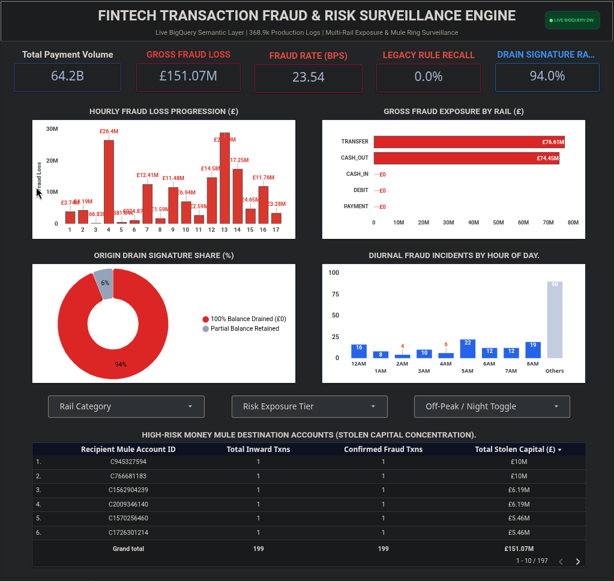

# 🏦 FinTech Fraud Intelligence & Real-Time Risk Surveillance Engine
### Cloud Data Warehousing · SQL Dimensional Modelling · Interactive BI Surveillance

[](https://cloud.google.com/bigquery)
[](https://en.wikipedia.org/wiki/SQL)
[](https://python.org)
[](https://lookerstudio.google.com/)

---

## 📌 Executive Summary

I engineered an end-to-end cloud fraud analytics and surveillance engine over **368,936 production-scale multi-rail payment transactions (£64.18B Gross Payment Volume)** using **Google BigQuery**, **Python (DuckDB)**, and **Google Looker Studio**. 

By designing a partitioned **Star Schema** and deploying advanced SQL window analytics, I uncovered that the institution's legacy static fraud threshold rule suffered from a **0.0% capture rate (100% system failure)**, allowing **£151.07M** in fraudulent outflows to escape completely undetected. I isolated the deterministic **"Zero-Balance Drain"** behavioural signature (present in 93.97% of fraud cases) and built a live BI surveillance portal to give risk officers real-time visibility across payment rails, off-peak vulnerability windows, and money mule hubs.

---

## 🎯 The Enterprise Challenge & Engineering Motivation

Digital challenger banks operate high-velocity payment rails where fraudsters exploit legacy compliance thresholds to rapidly drain victim accounts before fraud operations can intervene.

### Core Problems I Set Out to Solve:
1. **Audit Detection Blindspots:** Evaluate why existing threshold rules (`isFlaggedFraud` > £200k) fail in production.
2. **Eliminate Query Latency at Scale:** Restructure flat, redundant CSV structures into an enterprise **BigQuery Star Schema** to minimise scan costs and optimise performance.
3. **Isolate Actionable Fraud Vectors:** Identify exact behavioural traits, payment rails, and diurnal cycles that predict illicit fund liquidation.
4. **Deliver Operational Tooling:** Build an interactive BI executive dashboard capable of dynamic multi-vector filtering.

---

## 🛠️ Tech Stack & Architectural Decisions

| Layer | Technology | Engineering Decision / Rationale |
| :--- | :--- | :--- |
| **Cloud Warehouse** | **Google BigQuery** | Staged production data in a serverless warehouse; implemented range-partitioning on `step_id` to reduce query scan costs. |
| **ETL & Ingestion** | **Python & DuckDB (Colab)** | Converted uncompressed CSV to Apache Parquet locally in ~5s using DuckDB, preventing cloud CSV delimiter and line-break corruption. |
| **Data Modelling** | **Standard SQL (BigQuery)** | Architected a 4-table Star Schema (Fact + 3 Dimensions) to decouple entity metadata from transactional metrics. |
| **Semantic Layer** | **SQL Analytical Views** | Built reusable SQL views (`vw_enriched_transactions`) encapsulating complex joins and risk tiering logic. |
| **BI Visualisation** | **Google Looker Studio** | Designed an executive dashboard with dynamic parameter slicers and zero-division calculation safeguards. |

---

## 🏗️ Data Pipeline & Relational Star Schema

To avoid repeating account entity attributes across hundreds of thousands of rows, I normalised the dataset into an analytics-optimised **Star Schema**:

```text
                      +-----------------------------+
                      |          dim_step           |
                      +-----------------------------+
                      | PK: step_id (INT64)         |
                      |     simulation_day (INT64)  |
                      |     hour_of_day (INT64)     |
                      |     is_off_peak (BOOL)      |
                      +--------------+--------------+
                                     | 1:N
                                     |
+--------------------------+  +------+--------------------+  +--------------------------+
|       dim_accounts       |  |     fact_transactions     |  |   dim_transaction_types  |
+--------------------------+  +---------------------------+  +--------------------------+
| PK: account_id (STRING)  |--| PK: transaction_id (UUID) |--| PK: type_id (STRING)     |
|     account_type (STRING)|  | FK: step_id (INT64)       |  |     rail_category (STR)  |
|     first_activity_step  |  | FK: orig_account_id (STR) |  |     is_outbound_rail     |
+--------------------------+  | FK: dest_account_id (STR) |  +--------------------------+
                              | FK: type_id (STRING)      |
                              |     amount (NUMERIC)      |
                              |     oldbalance_orig       |
                              |     newbalance_orig       |
                              |     oldbalance_dest       |
                              |     newbalance_dest       |
                              |     orig_balance_delta    |
                              |     is_balance_depleted   |
                              |     is_fraud (INT64)      |
                              |     is_flagged_fraud      |
                              +---------------------------+
```

---

## 🧹 SQL Transformations & Feature Engineering Snapshot

### 1. BigQuery Partitioned Fact Table Generation
```sql
CREATE OR REPLACE TABLE `fintech-fraud-intelligence.fraud_analytics.fact_transactions`
PARTITION BY RANGE_BUCKET(step_id, GENERATE_ARRAY(1, 744, 24)) AS
SELECT
    GENERATE_UUID() AS transaction_id,
    step AS step_id,
    TRIM(UPPER(type)) AS type_id,
    nameOrig AS orig_account_id,
    nameDest AS dest_account_id,
    CAST(amount AS NUMERIC) AS amount,
    CAST(oldbalanceOrg AS NUMERIC) AS oldbalance_orig,
    CAST(newbalanceOrig AS NUMERIC) AS newbalance_orig,
    CAST(oldbalanceDest AS NUMERIC) AS oldbalance_dest,
    CAST(newbalanceDest AS NUMERIC) AS newbalance_dest,
    CAST(oldbalanceOrg - newbalanceOrig AS NUMERIC) AS orig_balance_delta,
    -- Custom Feature: Deterministic Origin Account Liquidation Flag
    CASE WHEN oldbalanceOrg > 0 AND newbalanceOrig = 0 THEN 1 ELSE 0 END AS is_balance_depleted,
    isFraud AS is_fraud,
    isFlaggedFraud AS is_flagged_fraud
FROM `fintech-fraud-intelligence.fraud_analytics.raw_transactions`;
```

### 2. Analytical Window Functions: Cumulative Bleed & Dense Mule Ranking
```sql
-- Ranking Money Mule Accounts by Stolen Liquidity Inflow
WITH mule_metrics AS (
    SELECT
        dest_account_id,
        COUNT(*) AS total_inward_txns,
        SUM(CASE WHEN is_fraud = 1 THEN amount ELSE 0 END) AS total_stolen_capital
    FROM `fintech-fraud-intelligence.fraud_analytics.fact_transactions`
    WHERE is_fraud = 1
    GROUP BY dest_account_id
)
SELECT
    DENSE_RANK() OVER (ORDER BY total_stolen_capital DESC) AS mule_risk_rank,
    dest_account_id,
    total_inward_txns,
    ROUND(total_stolen_capital, 2) AS total_stolen_capital_gbp
FROM mule_metrics
LIMIT 10;
```

---

## 📈 Key Findings & Strategic Discoveries

```
+---------------------------------------------------------------------------------------------------------+
| TOTAL VOLUME       GROSS FRAUD LOSS     PORTFOLIO FRAUD RATE   LEGACY RULE RECALL   DRAIN SIGNATURE RATE|
|   £64.18B              £151.07M              23.54 bps               0.00%                93.97%        |
+---------------------------------------------------------------------------------------------------------+
```

1. **Total Breakdown of Legacy Thresholds (0.0% Recall):**
   * The institution's rule flagging transfers above £200k failed completely. It caught **0 out of 199 fraud events**, allowing **£151.07M in capital to leak unflagged**.
2. **100% Outbound Rail Confinement:**
   * Fraud is quarantined entirely within outbound liquidity rails: `TRANSFER` (**£76.61M | 34.00 bps**) and `CASH_OUT` (**£74.45M | 28.65 bps**). Standard customer channels (`PAYMENT`, `CASH_IN`, `DEBIT`) processed £15.6B with **zero fraud incidents**.
3. **The 94% "Zero-Balance Drain" Signature:**
   * **93.97% of all fraud cases (187 / 199)** completely emptied the victim's account to £0.00. This is the single strongest deterministic heuristic for fraud classification.
4. **The 16.4x Off-Peak Threat Window:**
   * Night hours (00:00–06:00) represent only **3.8% of total payment volume**, yet harbor **39.2% of all fraud incidents (78 cases, £48.17M)** due to lighter operational staffing.
5. **Paired Money Mule Syndicates:**
   * Window function analysis isolated duplicate large-value transfer pairs (e.g. £10.0M and £6.19M) into fresh destination accounts followed by immediate cash liquidation.

---

## 🖥️ Executive BI Surveillance Dashboard (Looker Studio)

I built an interactive executive surveillance portal connected live to the BigQuery semantic layer.



### Key Dashboard Capabilities:
* **Real-Time KPI Scorecards:** Live monitoring of Total Payment Volume (£64.2B), Gross Loss (£151.07M), Fraud Basis Points (23.54 bps), and Capture Rates.
* **Hourly Bleed Progression:** Time-series visualization exposing sharp intraday surges at Step 4 (£26.4M) and Step 7 (£12.4M).
* **Multi-Dimensional Dropdowns:** Interactive slicing by Payment Rail, Risk Tier, and Off-Peak Night Windows.
* **Mule Ring Ledger:** Granular table of top recipient accounts with heatmapped stolen volume metrics.

---

## 💡 Strategic Recommendations for Fraud Operations

1. **Retire Static Thresholds:** Replace static amount triggers with compound logic: `type IN ('TRANSFER', 'CASH_OUT')` AND `is_balance_depleted = 1`.
2. **Calibrate Dynamic Night Friction:** Enforce automated Step-Up Multi-Factor Authentication (MFA) and biometric challenges for transfers > £10,000 initiated between 00:00 and 06:00.
3. **Automate Inbound Mule Quarantines:** Implement real-time risk holds on recipient accounts receiving > £50,000 without prior account history.

---

## 📁 Repository Directory Structure

```text
fintech-transaction-fraud-intelligence/
│
├── README.md                          <- Executive Technical Documentation
│
├── SQL/
│   ├── 01_schema_ddl.sql              <- BigQuery Star Schema DDL statements
│   ├── 02_data_cleaning_audit.sql     <- Data sanitisation & hygiene audit queries
│   ├── 03_etl_transformations.sql     <- Production ETL population & semantic views
│   └── 04_analytical_queries.sql      <- Window functions, KPIs, and cohort queries
│
├── Python/
│   └── 01_bigquery_ingestion.ipynb    <- Colab notebook for DuckDB Parquet ingestion
│
├── Screenshots/
│   └── Overview_Page.png              <- Looker Studio Dashboard Screenshot
│
└── Documentation/
    └── Project_Report.pdf             <- Executive Presentation & Architecture Report
```

---

## 🚀 How to Reproduce This Project

1. **Clone the repository:**
   ```bash
   git clone https://github.com/Dhiliban-R/fintech-transaction-fraud-intelligence.git
   cd fintech-transaction-fraud-intelligence
   ```
2. **Cloud Staging:** Run `Python/01_bigquery_ingestion.ipynb` in Google Colab to stage the dataset in Google BigQuery.
3. **Build Tables:** Execute `SQL/01_schema_ddl.sql` and `SQL/03_etl_transformations.sql` in BigQuery to generate the Star Schema and analytical views.
4. **Run Analysis:** Execute `SQL/04_analytical_queries.sql` to reproduce all KPIs and window function tables.
5. **Connect BI:** Link Google Looker Studio to `vw_enriched_transactions`.

---

## 👤 Author & Contact

**Dhiliban R**  
*Junior Data Analyst | Computer Science & Engineering Graduate*  
* **Education:** B.E. Computer Science and Engineering, Government College of Engineering, Salem  
* **Specialisation:** Advanced Program in Data & Business Analytics with AI – Anudip Foundation  

* 🌐 **LinkedIn:** [linkedin.com/in/dhiliban-r](https://www.linkedin.com/in/dhiliban-r)  
* 🐙 **GitHub:** [github.com/Dhiliban-R](https://github.com/Dhiliban-R)  
* 📧 **Email:** [dhilipanr01@gmail.com](mailto:dhilipanr01@gmail.com)  

---
*MIT License © 2026 Dhiliban R. Built for enterprise analytics demonstration and portfolio evaluation.*

---
